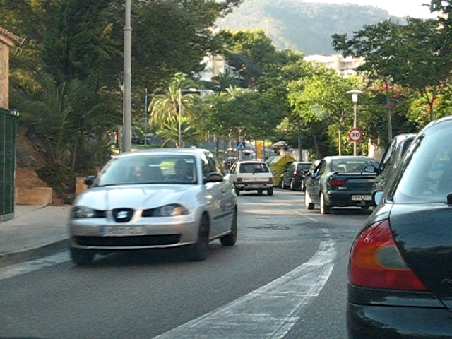

# Optical Flow
We implement two optical flow estimation methods based on OpenCV, including:

1. several functions from OpenCV 
2. open-source optical flow algorithms from [http://people.csail.mit.edu/celiu/OpticalFlow/](http://people.csail.mit.edu/celiu/OpticalFlow/).


## Install and run
```
mkdir build && cd build
cmake ..
make -j4
./Coarse2FineTwoFrames
```


## results
<p align="center">

<p align="center">

<p align="center">
<em>From left to right: img1, the warp result from img2 to img1, img2</em>

